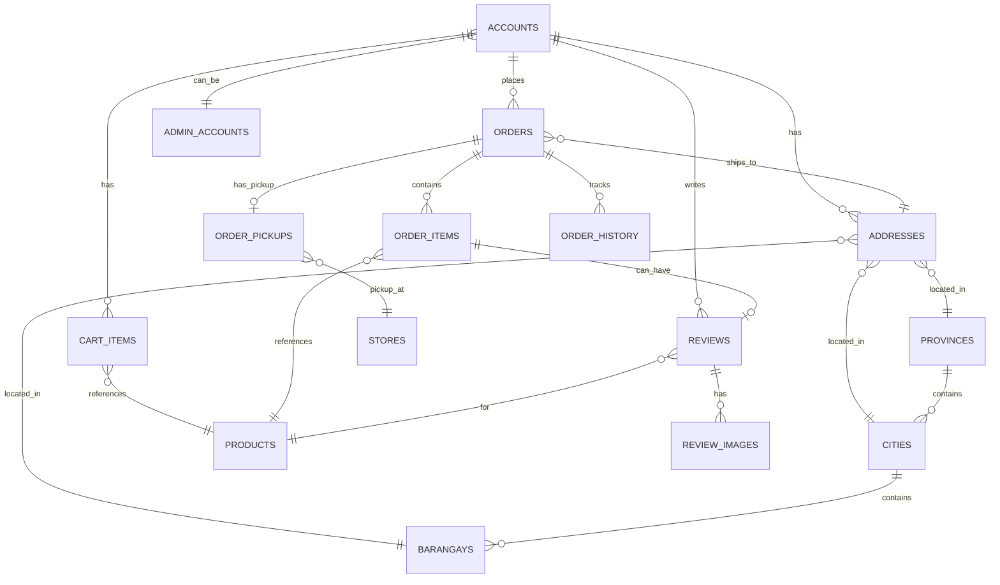

# DALI E-Commerce - Complete Documentation

## Table of Contents
1. [Database Schema](#database-schema)
2. [API Reference](#api-reference)
3. [User Flows](#user-flows)
4. [Admin Flows](#admin-flows)

---

## Database Schema

### Entity Relationship Diagram



---

### Tables Reference

#### 1. `accounts`
User accounts for customers.

| Column | Type | Constraints | Description |
|--------|------|-------------|-------------|
| account_id | SERIAL | PRIMARY KEY | Unique identifier |
| account_first_name | VARCHAR(255) | | User's first name |
| account_last_name | VARCHAR(255) | | User's last name |
| account_email | VARCHAR(255) | UNIQUE, NOT NULL | Login email |
| password_hash | VARCHAR(255) | NOT NULL | Bcrypt hashed password |
| phone_number | VARCHAR(50) | | Contact number |
| profile_picture | VARCHAR(255) | | URL to profile image |
| reset_password_token | VARCHAR(255) | | Token for password reset |
| is_email_verified | BOOLEAN | DEFAULT FALSE | Email verification status |
| email_verification_token | VARCHAR(255) | | Token for email verification |
| is_super_admin | BOOLEAN | DEFAULT FALSE | Super admin privileges |

#### 2. `admin_accounts`
Admin users with dashboard access.

| Column | Type | Constraints | Description |
|--------|------|-------------|-------------|
| admin_id | SERIAL | PRIMARY KEY | Unique identifier |
| account_email | VARCHAR(255) | UNIQUE, NOT NULL | Admin login email |
| password_hash | VARCHAR(255) | NOT NULL | Bcrypt hashed password |
| is_super_admin | BOOLEAN | DEFAULT FALSE | Super admin privileges |

#### 3. `products`
Product catalog.

| Column | Type | Constraints | Description |
|--------|------|-------------|-------------|
| product_id | SERIAL | PRIMARY KEY | Unique identifier |
| product_name | VARCHAR(255) | NOT NULL | Product name |
| product_description | TEXT | | Detailed description |
| product_price | NUMERIC(10,2) | NOT NULL | Price in PHP |
| product_category | VARCHAR(255) | | Main category |
| product_subcategory | VARCHAR(255) | | Sub-category |
| product_quantity | INTEGER | NOT NULL | Stock quantity |
| image | VARCHAR(255) | | Product image filename |

#### 4. `addresses`
Customer shipping addresses.

| Column | Type | Constraints | Description |
|--------|------|-------------|-------------|
| address_id | SERIAL | PRIMARY KEY | Unique identifier |
| account_id | INTEGER | FK → accounts, NOT NULL | Owner account |
| province_id | INTEGER | FK → provinces, NOT NULL | Province |
| city_id | INTEGER | FK → cities, NOT NULL | City/Municipality |
| barangay_id | INTEGER | FK → barangays, NOT NULL | Barangay |
| additional_info | VARCHAR(1024) | | Street, building, etc. |
| phone_number | VARCHAR(50) | | Contact for delivery |
| latitude | NUMERIC(10,7) | | GPS latitude |
| longitude | NUMERIC(10,7) | | GPS longitude |
| is_default | BOOLEAN | DEFAULT FALSE | Default shipping address |
| created_at | TIMESTAMP | DEFAULT NOW | Creation timestamp |

#### 5. `orders`
Customer orders.

| Column | Type | Constraints | Description |
|--------|------|-------------|-------------|
| order_id | SERIAL | PRIMARY KEY | Unique identifier |
| account_id | INTEGER | FK → accounts, NOT NULL | Customer |
| address_id | INTEGER | FK → addresses, NOT NULL | Shipping address |
| payment_status | VARCHAR(255) | CHECK IN (...), NOT NULL | PENDING, PAID, CANCELLED, REFUNDED |
| shipping_status | VARCHAR(255) | CHECK IN (...), NOT NULL | PROCESSING, PREPARING_FOR_SHIPMENT, IN_TRANSIT, DELIVERED, COLLECTED, CANCELLED, DELIVERY_FAILED |
| payment_transaction_id | VARCHAR(255) | | Maya transaction ID |
| delivery_method | VARCHAR(255) | NOT NULL | "Standard Delivery" or "Pickup Delivery" |
| payment_method | VARCHAR(255) | NOT NULL | "Maya", "COD", etc. |
| total_price | NUMERIC(10,2) | NOT NULL | Total including shipping |
| created_at | TIMESTAMP | DEFAULT NOW | Order creation time |
| updated_at | TIMESTAMP | DEFAULT NOW | Last update time |

#### 6. `order_items`
Products within an order.

| Column | Type | Constraints | Description |
|--------|------|-------------|-------------|
| order_item_id | SERIAL | PRIMARY KEY | Unique identifier |
| order_id | INTEGER | FK → orders, NOT NULL | Parent order |
| product_id | INTEGER | FK → products, NOT NULL | Product ordered |
| quantity | INTEGER | NOT NULL | Quantity ordered |

#### 7. `order_pickups`
Store pickup information for Click & Collect orders.

| Column | Type | Constraints | Description |
|--------|------|-------------|-------------|
| order_pickup_id | SERIAL | PRIMARY KEY | Unique identifier |
| order_id | INTEGER | FK → orders, UNIQUE, NOT NULL | Order reference |
| store_id | INTEGER | FK → stores, NOT NULL | Pickup store |

#### 8. `order_history`
Order status change history.

| Column | Type | Constraints | Description |
|--------|------|-------------|-------------|
| history_id | SERIAL | PRIMARY KEY | Unique identifier |
| order_id | INTEGER | FK → orders, NOT NULL | Order reference |
| status | VARCHAR(255) | NOT NULL | Status at this point |
| notes | VARCHAR(1024) | NOT NULL | Description of change |
| event_timestamp | TIMESTAMP | DEFAULT NOW | When status changed |

#### 9. `cart_items`
Shopping cart items.

| Column | Type | Constraints | Description |
|--------|------|-------------|-------------|
| cart_item_id | SERIAL | PRIMARY KEY | Unique identifier |
| account_id | INTEGER | FK → accounts, NOT NULL | Cart owner |
| product_id | INTEGER | FK → products, NOT NULL | Product in cart |
| quantity | INTEGER | NOT NULL | Quantity |
| | | UNIQUE(account_id, product_id) | One entry per product |

#### 10. `reviews`
Product reviews from customers.

| Column | Type | Constraints | Description |
|--------|------|-------------|-------------|
| review_id | SERIAL | PRIMARY KEY | Unique identifier |
| product_id | INTEGER | FK → products, NOT NULL | Reviewed product |
| account_id | INTEGER | FK → accounts, NOT NULL | Reviewer |
| order_id | INTEGER | FK → orders, NOT NULL | Associated order |
| order_item_id | INTEGER | FK → order_items, UNIQUE, NOT NULL | Specific item reviewed |
| rating | INTEGER | CHECK 1-5, NOT NULL | Star rating |
| comment | TEXT | | Review text |
| is_anonymous | BOOLEAN | DEFAULT FALSE | Hide reviewer name |
| is_edited | BOOLEAN | DEFAULT FALSE | Has been edited (one-time edit allowed) |
| created_at | TIMESTAMP | DEFAULT NOW | Review creation time |
| updated_at | TIMESTAMP | DEFAULT NOW | Last edit time |

#### 11. `review_images`
Images attached to reviews.

| Column | Type | Constraints | Description |
|--------|------|-------------|-------------|
| image_id | SERIAL | PRIMARY KEY | Unique identifier |
| review_id | INTEGER | FK → reviews, NOT NULL | Parent review |
| image_url | VARCHAR(512) | NOT NULL | Image URL path |
| created_at | TIMESTAMP | DEFAULT NOW | Upload time |

#### 12. `stores`
Physical store locations for Click & Collect.

| Column | Type | Constraints | Description |
|--------|------|-------------|-------------|
| store_id | SERIAL | PRIMARY KEY | Unique identifier |
| store_name | VARCHAR(255) | NOT NULL | Store name |
| store_lat | NUMERIC(10,7) | | GPS latitude |
| store_lng | NUMERIC(10,7) | | GPS longitude |

#### 13. Location Tables (`provinces`, `cities`, `barangays`)
Philippine location hierarchy.

**provinces**
| Column | Type | Constraints |
|--------|------|-------------|
| province_id | SERIAL | PRIMARY KEY |
| province_name | VARCHAR(255) | UNIQUE, NOT NULL |

**cities**
| Column | Type | Constraints |
|--------|------|-------------|
| city_id | SERIAL | PRIMARY KEY |
| province_id | INTEGER | FK → provinces, NOT NULL |
| city_name | VARCHAR(255) | NOT NULL |
| | | UNIQUE(province_id, city_name) |

**barangays**
| Column | Type | Constraints |
|--------|------|-------------|
| barangay_id | SERIAL | PRIMARY KEY |
| city_id | INTEGER | FK → cities, NOT NULL |
| barangay_name | VARCHAR(255) | NOT NULL |
| | | UNIQUE(city_id, barangay_name) |

#### 14. `audit_logs`
Audit trail for admin actions.

| Column | Type | Constraints | Description |
|--------|------|-------------|-------------|
| log_id | SERIAL | PRIMARY KEY | Unique identifier |
| actor_email | VARCHAR(255) | NOT NULL | Admin who performed action |
| action | VARCHAR(255) | NOT NULL | Action type (CREATE, UPDATE, DELETE) |
| entity_type | VARCHAR(255) | NOT NULL | Entity affected (order, product, etc.) |
| entity_id | INTEGER | | ID of affected entity |
| details | TEXT | | Additional details/context |
| created_at | TIMESTAMP | DEFAULT NOW | When action occurred |

---

## API Reference

Base URL: `http://localhost:8000/api`

### Authentication (`/api/auth`)

| Method | Endpoint | Description | Auth Required |
|--------|----------|-------------|---------------|
| POST | `/register` | Create new account | No |
| POST | `/login` | Login and create session | No |
| POST | `/logout` | End session | Yes |
| GET | `/me` | Get current user info | Yes |
| PUT | `/profile` | Update user profile | Yes |
| POST | `/profile/picture` | Upload profile picture | Yes |
| DELETE | `/profile/picture` | Delete profile picture | Yes |
| POST | `/change-password` | Change password | Yes |
| POST | `/forgot-password` | Request password reset email | No |
| POST | `/reset-password` | Reset password with token | No |
| POST | `/verify-email` | Verify email with token | No |
| POST | `/resend-verification` | Resend verification email | Yes |

### Products (`/api/products`)

| Method | Endpoint | Description | Auth Required |
|--------|----------|-------------|---------------|
| GET | `/` | List all products | No |
| GET | `/{id}` | Get product details | No |
| GET | `/categories` | Get all categories | No |
| GET | `/category/{category}` | Get products by category | No |
| GET | `/search?q=...` | Search products | No |

### Cart (`/api/cart`)

| Method | Endpoint | Description | Auth Required |
|--------|----------|-------------|---------------|
| GET | `/` | Get cart items | Yes |
| POST | `/add` | Add item to cart | Yes |
| PUT | `/update/{product_id}` | Update item quantity | Yes |
| DELETE | `/remove/{product_id}` | Remove item from cart | Yes |
| DELETE | `/clear` | Clear entire cart | Yes |
| GET | `/count` | Get cart item count | Yes |

### Checkout (`/api/checkout`)

| Method | Endpoint | Description | Auth Required |
|--------|----------|-------------|---------------|
| POST | `/calculate-shipping` | Calculate shipping fee | Yes |
| POST | `/place-order` | Create new order | Yes |
| POST | `/maya/callback` | Maya payment webhook | No |

### Orders (`/api/orders`)

| Method | Endpoint | Description | Auth Required |
|--------|----------|-------------|---------------|
| GET | `/` | List user's orders | Yes |
| GET | `/{id}` | Get order details | Yes |
| POST | `/{id}/cancel` | Cancel order | Yes |

### Addresses (`/api/addresses`)

| Method | Endpoint | Description | Auth Required |
|--------|----------|-------------|---------------|
| GET | `/` | List user's addresses | Yes |
| POST | `/` | Create new address | Yes |
| GET | `/{id}` | Get address details | Yes |
| PUT | `/{id}` | Update address | Yes |
| DELETE | `/{id}` | Delete address | Yes |
| PUT | `/{id}/default` | Set as default address | Yes |

### Locations (`/api/locations`)

| Method | Endpoint | Description | Auth Required |
|--------|----------|-------------|---------------|
| GET | `/provinces` | List all provinces | No |
| GET | `/provinces/{id}/cities` | Get cities in province | No |
| GET | `/cities/{id}/barangays` | Get barangays in city | No |

### Stores (`/api/stores`)

| Method | Endpoint | Description | Auth Required |
|--------|----------|-------------|---------------|
| GET | `/` | List all stores | No |
| GET | `/{id}` | Get store details | No |

### Reviews (`/api/reviews`)

| Method | Endpoint | Description | Auth Required |
|--------|----------|-------------|---------------|
| GET | `/product/{id}` | Get product reviews | No |
| GET | `/product/{id}/summary` | Get review summary (avg rating, count) | No |
| GET | `/order/{id}/reviewable` | Get items that can be reviewed | Yes |
| POST | `/` | Create review | Yes |
| POST | `/{id}/images` | Upload review image | Yes |
| PUT | `/{id}` | Update review (one-time only) | Yes |
| DELETE | `/{id}` | Delete review | Yes |

### Admin (`/api/admin`)

| Method | Endpoint | Description | Auth Required |
|--------|----------|-------------|---------------|
| POST | `/login` | Admin login | No |
| POST | `/logout` | Admin logout | Admin |
| GET | `/me` | Get admin info | Admin |
| GET | `/dashboard` | Dashboard stats | Admin |
| GET | `/orders` | List all orders | Admin |
| GET | `/orders/{id}` | Get order details | Admin |
| PUT | `/orders/{id}/status` | Update order status | Admin |
| GET | `/inventory` | List all products | Admin |
| PUT | `/inventory/{id}` | Update product stock | Admin |
| PUT | `/products/{id}/price` | Update product price | Admin |

---

## User Flows

### 1. Registration & Authentication Flow

```
┌─────────────────────────────────────────────────────────────┐
│                    USER REGISTRATION                         │
├─────────────────────────────────────────────────────────────┤
│  1. User fills registration form                            │
│     └─> POST /api/auth/register                             │
│                                                              │
│  2. System creates account (unverified)                     │
│     └─> Sends verification email                            │
│                                                              │
│  3. User clicks email link                                  │
│     └─> POST /api/auth/verify-email?token=...               │
│                                                              │
│  4. Account verified → User can login                       │
│     └─> POST /api/auth/login                                │
│                                                              │
│  5. Session cookie set → Authenticated                      │
└─────────────────────────────────────────────────────────────┘
```

### 2. Shopping Flow

```
┌─────────────────────────────────────────────────────────────┐
│                    SHOPPING FLOW                             │
├─────────────────────────────────────────────────────────────┤
│  1. Browse Products                                          │
│     ├─> GET /api/products                                   │
│     ├─> GET /api/products/categories                        │
│     └─> GET /api/products/search?q=...                      │
│                                                              │
│  2. View Product Details                                     │
│     ├─> GET /api/products/{id}                              │
│     └─> GET /api/reviews/product/{id}/summary               │
│                                                              │
│  3. Add to Cart (must be logged in)                         │
│     └─> POST /api/cart/add {product_id, quantity}           │
│                                                              │
│  4. View/Update Cart                                         │
│     ├─> GET /api/cart                                       │
│     ├─> PUT /api/cart/update/{product_id}                   │
│     └─> DELETE /api/cart/remove/{product_id}                │
└─────────────────────────────────────────────────────────────┘
```

### 3. Checkout Flow

```
┌─────────────────────────────────────────────────────────────┐
│                    CHECKOUT FLOW                             │
├─────────────────────────────────────────────────────────────┤
│  1. Select Delivery Method                                   │
│     ├─> Standard Delivery: Select/Add Address               │
│     └─> Click & Collect: Select Store                       │
│                                                              │
│  2. Calculate Shipping (Standard Delivery only)              │
│     └─> POST /api/checkout/calculate-shipping               │
│         {address_id} → Returns shipping_fee                 │
│                                                              │
│  3. Select Payment Method                                    │
│     ├─> Cash on Delivery (COD)                              │
│     └─> Maya (Online Payment)                               │
│                                                              │
│  4. Place Order                                              │
│     └─> POST /api/checkout/place-order                      │
│         {address_id, delivery_method, payment_method,        │
│          store_id (if pickup)}                              │
│                                                              │
│  5a. COD: Order created with PENDING payment                 │
│      └─> Redirect to order success page                     │
│                                                              │
│  5b. Maya: Redirect to Maya payment page                     │
│      └─> On success: POST /api/checkout/maya/callback       │
│      └─> Redirect to success page                           │
└─────────────────────────────────────────────────────────────┘
```

### 4. Order Lifecycle

```
┌─────────────────────────────────────────────────────────────┐
│                    ORDER STATES                              │
├─────────────────────────────────────────────────────────────┤
│                                                              │
│  PROCESSING ──────────────────────────────────────────────► │
│       │                                                      │
│       ├─> Customer can CANCEL                               │
│       │                                                      │
│       ▼                                                      │
│  PREPARING_FOR_SHIPMENT ─────────────────────────────────► │
│       │                                                      │
│       ▼                                                      │
│  IN_TRANSIT (for Standard Delivery) ─────────────────────► │
│       │                                                      │
│       ├─> DELIVERED ──────────────────────────────────────► │
│       │       └─> Customer can write REVIEW                 │
│       │                                                      │
│       └─> DELIVERY_FAILED                                   │
│                                                              │
│  ─── OR (for Click & Collect) ───                           │
│                                                              │
│  PREPARING_FOR_SHIPMENT ─────────────────────────────────► │
│       │                                                      │
│       ▼                                                      │
│  COLLECTED ───────────────────────────────────────────────► │
│       └─> Customer can write REVIEW                         │
│                                                              │
└─────────────────────────────────────────────────────────────┘
```

### 5. Review Flow

```
┌─────────────────────────────────────────────────────────────┐
│                    REVIEW FLOW                               │
├─────────────────────────────────────────────────────────────┤
│  Prerequisites:                                              │
│  - Order status must be DELIVERED or COLLECTED              │
│  - Each order item can only be reviewed ONCE                │
│                                                              │
│  1. View Order Details                                       │
│     └─> GET /api/orders/{id}                                │
│                                                              │
│  2. Check Reviewable Items                                   │
│     └─> GET /api/reviews/order/{id}/reviewable              │
│         Returns items with is_reviewed status               │
│                                                              │
│  3. Write Review                                             │
│     └─> POST /api/reviews                                   │
│         {order_item_id, rating, comment, is_anonymous}      │
│                                                              │
│  4. Upload Images (optional, max 5)                          │
│     └─> POST /api/reviews/{id}/images                       │
│         FormData with file                                  │
│                                                              │
│  5. Edit Review (ONE TIME ONLY)                              │
│     └─> PUT /api/reviews/{id}                               │
│         {rating, comment, is_anonymous}                     │
│         Sets is_edited = true                               │
│                                                              │
│  6. After edit, no more edits allowed                        │
└─────────────────────────────────────────────────────────────┘
```

### 6. Address Management Flow

```
┌─────────────────────────────────────────────────────────────┐
│                    ADDRESS MANAGEMENT                        │
├─────────────────────────────────────────────────────────────┤
│  1. Get Location Data                                        │
│     ├─> GET /api/locations/provinces                        │
│     ├─> GET /api/locations/provinces/{id}/cities            │
│     └─> GET /api/locations/cities/{id}/barangays            │
│                                                              │
│  2. Create Address                                           │
│     └─> POST /api/addresses                                 │
│         {province_id, city_id, barangay_id,                 │
│          additional_info, phone_number,                     │
│          latitude, longitude, is_default}                   │
│                                                              │
│  3. Manage Addresses                                         │
│     ├─> GET /api/addresses (list all)                       │
│     ├─> PUT /api/addresses/{id} (update)                    │
│     ├─> DELETE /api/addresses/{id} (delete)                 │
│     └─> PUT /api/addresses/{id}/default (set default)       │
└─────────────────────────────────────────────────────────────┘
```

---

## Admin Flows

### 1. Admin Authentication

```
┌─────────────────────────────────────────────────────────────┐
│                    ADMIN LOGIN                               │
├─────────────────────────────────────────────────────────────┤
│  1. Admin navigates to /admin/login                          │
│                                                              │
│  2. POST /api/admin/login                                    │
│     {email, password}                                       │
│                                                              │
│  3. Admin session created → Redirect to dashboard           │
└─────────────────────────────────────────────────────────────┘
```

### 2. Order Management

```
┌─────────────────────────────────────────────────────────────┐
│                    ORDER MANAGEMENT                          │
├─────────────────────────────────────────────────────────────┤
│  1. View All Orders                                          │
│     └─> GET /api/admin/orders                               │
│         Optional filters: status, date range                │
│                                                              │
│  2. View Order Details                                       │
│     └─> GET /api/admin/orders/{id}                          │
│                                                              │
│  3. Update Order Status                                      │
│     └─> PUT /api/admin/orders/{id}/status                   │
│         {status, notes}                                     │
│                                                              │
│  Valid Status Transitions:                                   │
│  - PROCESSING → PREPARING_FOR_SHIPMENT                      │
│  - PREPARING_FOR_SHIPMENT → IN_TRANSIT (delivery)           │
│  - PREPARING_FOR_SHIPMENT → COLLECTED (pickup)              │
│  - IN_TRANSIT → DELIVERED                                   │
│  - IN_TRANSIT → DELIVERY_FAILED                             │
│  - Any → CANCELLED                                          │
└─────────────────────────────────────────────────────────────┘
```

### 3. Inventory Management

```
┌─────────────────────────────────────────────────────────────┐
│                    INVENTORY MANAGEMENT                      │
├─────────────────────────────────────────────────────────────┤
│  1. View All Products                                        │
│     └─> GET /api/admin/inventory                            │
│                                                              │
│  2. Update Stock Quantity                                    │
│     └─> PUT /api/admin/inventory/{product_id}               │
│         {quantity}                                          │
│                                                              │
│  3. Update Product Price                                     │
│     └─> PUT /api/admin/products/{product_id}/price          │
│         {price}                                             │
└─────────────────────────────────────────────────────────────┘
```

### 4. Dashboard Statistics

```
┌─────────────────────────────────────────────────────────────┐
│                    DASHBOARD STATS                           │
├─────────────────────────────────────────────────────────────┤
│  GET /api/admin/dashboard                                    │
│                                                              │
│  Returns:                                                    │
│  - total_orders: Total orders count                         │
│  - pending_orders: Orders awaiting processing               │
│  - total_revenue: Sum of paid orders                        │
│  - total_products: Product count                            │
│  - low_stock_products: Products with quantity < 10          │
│  - recent_orders: Last 5 orders                             │
└─────────────────────────────────────────────────────────────┘
```

---

## Payment Integration

### Maya (PayMaya) Sandbox

The application integrates with Maya sandbox for online payments.

**Flow:**
1. Customer selects Maya as payment method
2. System creates checkout session via Maya API
3. Customer redirected to Maya payment page
4. After payment, Maya calls webhook: `POST /api/checkout/maya/callback`
5. System updates order payment status to PAID
6. Customer redirected to success page

**Environment Variables:**
```
MAYA_API_KEY=your_api_key
MAYA_SECRET_KEY=your_secret_key
MAYA_PUBLIC_KEY=your_public_key
MAYA_BASE_URL=https://pg-sandbox.paymaya.com
```

### Cash on Delivery (COD)

- Order created with `payment_status: PENDING`
- Payment collected upon delivery
- Admin marks order as PAID after collection

---

## Shipping Fee Calculation

Shipping fee is calculated based on geodesic distance from warehouse to delivery address.

**Formula:**
- Base rate: ₱50
- Per km rate: ₱5/km
- Minimum fee: ₱50
- Free shipping: Orders over ₱1,500

**Warehouse Location (configurable):**
```
WAREHOUSE_LAT=14.5995
WAREHOUSE_LON=120.9842
```

---

## File Storage

**Profile Pictures:** `/static/images/profiles/`
**Review Images:** `/static/images/reviews/`
**Product Images:** `frontend/public/images/products/`

All uploaded images are served via the `/static` route, proxied through Vite in development.
